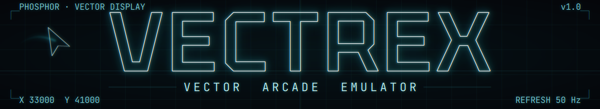
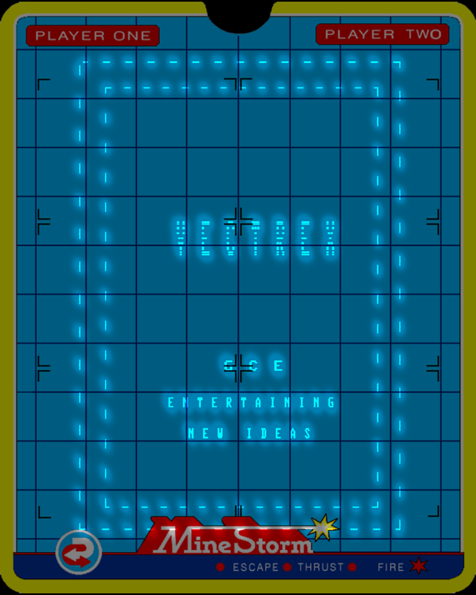
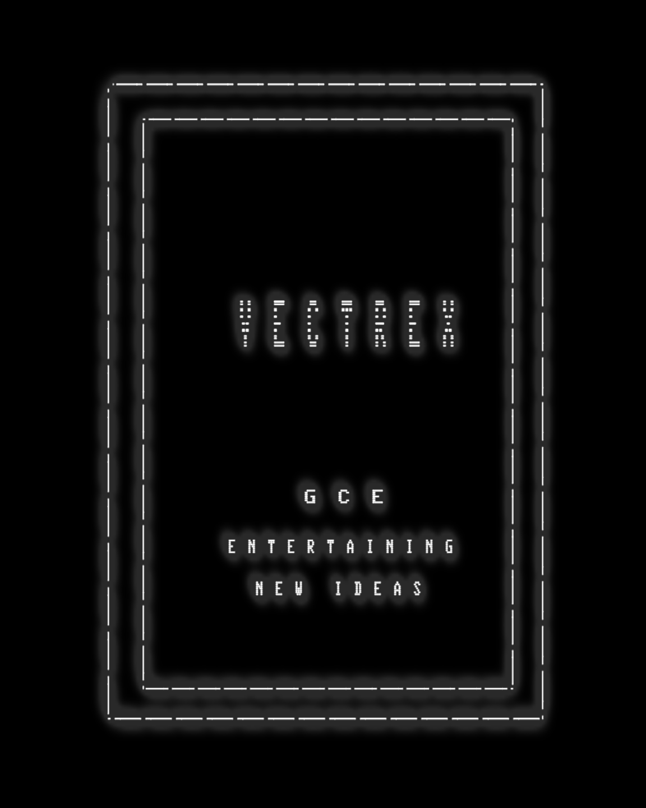
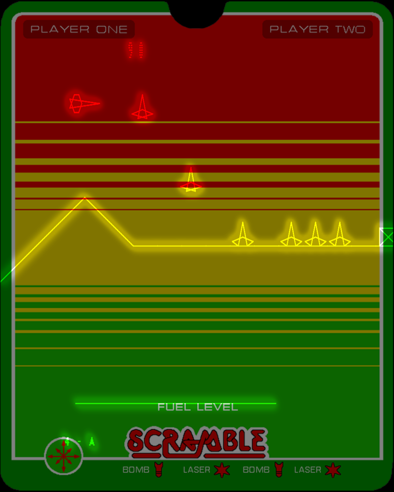
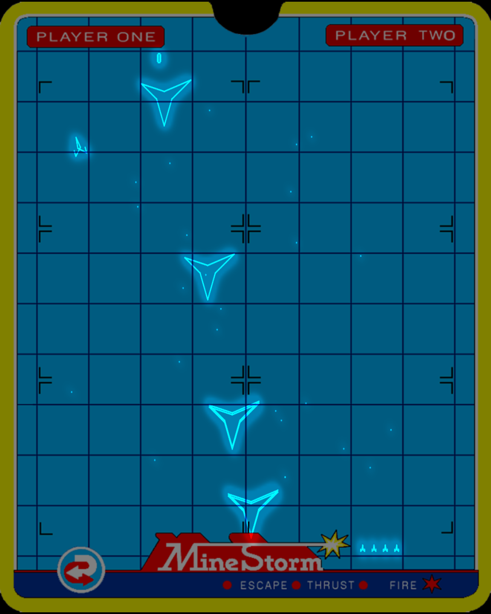
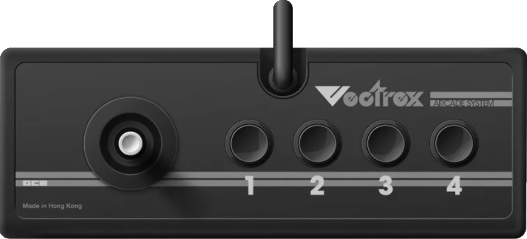

<p align="center">
  
</p>

<h1 align="center">vectrex-emu</h1>

<p align="center">
  A Windows Vectrex emulator with a glowing, phosphor-accurate OpenGL vector renderer.
</p>

<p align="center">
  <a href="LICENSE"></a>
  
  
  
  
</p>

<p align="center">
  
  
  
  
</p>

---

**vectrex-emu** emulates the 1982 GCE/MB Vectrex — the only home console with a built-in
vector monitor. The machine glue is built on the well-known **vecx** core (MC6809 CPU,
6522 VIA, AY-3-8910 sound), and the picture is drawn through an **OpenGL vector-glow
pipeline ported from AAE** (bloom, phosphor trail, and authentic beam falloff) so games
look like the real CRT instead of flat lines. Color **overlays** — the translucent plastic
art sheets that shipped with each cartridge — are reproduced per game.

> ⚠️ **ROMs are not included.** Mine Storm (the pack-in game) is built into the BIOS, but
> you must supply your own legally-obtained cartridge ROMs for everything else.

## Features

- 🕹️ **Accurate Vectrex hardware** — MC6809 CPU, 6522 VIA timing, AY-3-8910 sound (vecx core).
- ✨ **Vector-glow renderer** — bloom + phosphor trail + per-beam intensity on an OpenGL
  framebuffer, with the Vectrex's natural portrait (pillarboxed) aspect.
- 🎨 **Cartridge overlays** — per-game PNG art is auto-loaded from `data\artwork` and blended
  as an `OVERLAY2` color gel; toggle it live from the **Video** menu.
- 🎚️ **Tunable picture** — glow amount, line width, endpoint size, and dot size, with live
  preview and per-game persistence.
- 🎮 **Two players, fully remappable** — keyboard *and* gamepad for P1 & P2, MAME/MESS
  default bindings, configured through a controller dialog and saved to `controls.ini`.
- 🔊 **Audio controls** — master volume plus an optional "flyback" ambient hum for that
  authentic Vectrex buzz.
- 🚀 **Front-end friendly** — command-line launching, fullscreen, window scaling, and an
  Esc-to-exit behavior tailored for launchers.

## Requirements

- Windows 10 or 11 (x64)
- A GPU/driver supporting **OpenGL 2.0+**
- One or more Vectrex ROMs (`.bin` / `.vec`) placed in `data\roms`
- *To build:* **Visual Studio 2022** with the *Desktop development with C++* workload
  (MSVC v143 toolset + Windows 10/11 SDK)

## Building

```sh
git clone https://github.com/<your-org>/vectrex-emu.git
cd vectrex-emu
```

**In Visual Studio:** open `vectrex-emu.sln`, choose the **Release | x64** configuration,
and build (`Ctrl+Shift+B`).

**From the command line:**

```powershell
& "C:\Program Files\Microsoft Visual Studio\2022\Community\MSBuild\Current\Bin\MSBuild.exe" `
    vectrex-emu.sln /p:Configuration=Release /p:Platform=x64 /m
```

The executable is produced at `x64\Release\vectrex-emu.exe`. Both **Release|x64** and
**Debug|x64** are supported; the Win32 (x86) configurations are unmaintained.

> The emulator runs from its own folder and expects a `data\` directory beside the exe
> (`data\roms`, `data\artwork`, `data\ini`, `data\samples`). Those folders are created
> automatically on first run if missing.

## Running

Double-click `vectrex-emu.exe`, then **File ▸ Load ROM…** (`Ctrl+O`). Drop your cartridge
ROMs in `data\roms` and matching overlay images in `data\artwork` (named after the ROM,
e.g. `scramble.bin` → `scramble.png`).

To launch a game directly — handy for front-ends:

```sh
vectrex-emu.exe -rom SCRAMBLE.BIN -fullscreen
```

## Controls

Default bindings follow the **MAME/MESS standard** layout. Both players work on the
keyboard out of the box; gamepads can be mapped to either player.

| Action      | Player 1 (keyboard) | Player 2 (keyboard) |
|-------------|---------------------|---------------------|
| Up / Down   | ↑ / ↓               | R / F               |
| Left / Right| ← / →               | D / G               |
| Button 1    | Left Ctrl           | A                   |
| Button 2    | Left Alt            | S                   |
| Button 3    | Space               | Q                   |
| Button 4    | Left Shift          | W                   |

**Gamepads / joysticks** use the D-pad (or hat) and buttons 1–4. Remap any control —
keyboard or pad, for either player — under **Settings ▸ Input (Controllers)…** (`Ctrl+I`).
Bindings are saved to `data\ini\controls.ini`.

<p align="center">
  
</p>

### Hotkeys

| Key      | Action                                                                 |
|----------|------------------------------------------------------------------------|
| `Ctrl+O` | Load ROM                                                               |
| `Ctrl+L` | Load overlay image                                                     |
| `Ctrl+R` | Reset                                                                  |
| `Ctrl+I` | Input / controller configuration                                       |
| `F11`    | Toggle fullscreen                                                      |
| `F12`    | Save a snapshot PNG to `data\snaps\<game>_<timestamp>.png`              |
| `Esc`    | Standalone: leave fullscreen / minimize · Launched from a front-end: quit |

Emulation pauses automatically while a menu or settings dialog is open.

## Menus

- **File** — Load ROM, Load/Clear Overlay, Reset, Snapshot (F12), Exit.
- **Video** — Fullscreen, window scale (1×/2×/3×/Fit), and live **Glow**, **Trail**, and
  **Overlay** toggles.
- **Settings**
  - **Vector Graphics…** — sliders for glow amount, line width, endpoint size, and dot size,
    with **Save as Default** / **Reset to Default** buttons.
  - **Input (Controllers)…** — the keyboard/gamepad mapper for both players.
  - **Audio…** — master volume and the optional ambient "flyback" hum.
- **Help** — About.

## Configuration

Settings are stored as plain `.ini` files under `data\ini\`:

| File                  | Purpose                                                                                  |
|-----------------------|------------------------------------------------------------------------------------------|
| `emulator.ini`        | Global defaults — `[video]` glow/line/point/dot/overlay/trail and `[audio]` volume/ambient. Written by **Save as Default**. |
| `<game>.ini`          | Per-game overrides. When you change a video setting while a game is loaded, it's saved here and re-applied (after the global defaults) the next time that ROM loads. |
| `controls.ini`        | Keyboard and joystick bindings for Player 1 and Player 2.                                 |

## Project layout

```
emulator/
├─ project/      vecx Vectrex core (memory map, VIA, AY-3-8910), emulator glue, BIOS
├─ cpu_code/     MC6809 CPU core
├─ aae_video/    AAE-derived OpenGL vector-glow renderer (bloom / trail / overlay)
├─ system/       Win32 host window, menus, dialogs, resources (host.rc)
├─ sys_audio/    mixer + sample playback
├─ sys_input/    keyboard / raw input / gamepad
├─ sys_video/    OpenGL context + presentation
├─ sys_graphics/ shader / primitive helpers
├─ sys_fileio/   file & sample loading (aae_fileio)
└─ 3rdparty/     stb_image and other vendored bits
data/            roms · artwork · ini · samples  (runtime data beside the exe)
```

## Acknowledgements

- **vecx** by *Valavan Manohararajah* — the Vectrex emulation core this project builds on.
- **AAE (Another Arcade Emulator)** — origin of the OpenGL vector-glow rendering pipeline.
- **Overlay artwork** — the Vectrex cartridge overlays come from Raph Koster's
  [raphkoster/vectrex-overlays](https://github.com/raphkoster/vectrex-overlays).
- **Controller illustration** — `vectrex_controller.png` (the Input dialog graphic) is by
  [pineapple.graphics](https://www.instagram.com/pineapple.graphics/).
- **stb_image** (public domain) — PNG overlay decoding.
- **GCE / Smith Engineering** — the original Vectrex hardware and Mine Storm.

*Vectrex is a trademark of its respective owners. This project is an independent,
non-commercial emulator and is not affiliated with or endorsed by any rights holder.*

## License

vectrex-emu is licensed under the **GNU General Public License v3.0** — see [LICENSE](LICENSE).

```
Copyright (C) 2026  Tim Cottrill and Claude Code 4.8

This program is free software: you can redistribute it and/or modify it under
the terms of the GNU General Public License as published by the Free Software
Foundation, either version 3 of the License, or (at your option) any later version.

This program is distributed in the hope that it will be useful, but WITHOUT ANY
WARRANTY; without even the implied warranty of MERCHANTABILITY or FITNESS FOR A
PARTICULAR PURPOSE.  See the GNU General Public License for more details.
```

The GPL covers the emulator's source. It does **not** grant any rights to Vectrex BIOS or
game ROMs — you are responsible for the legality of any ROM images you use.
